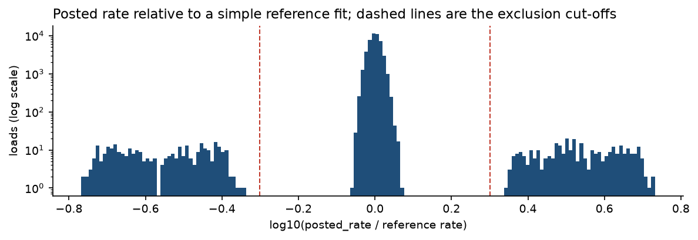
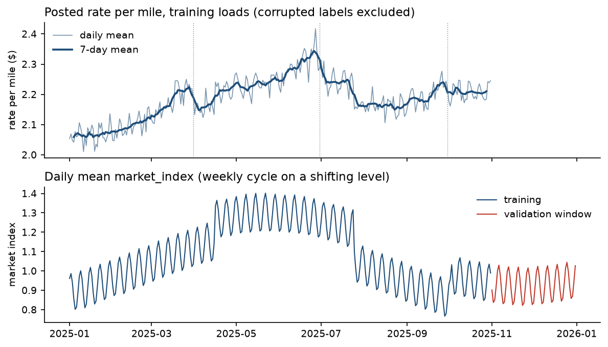
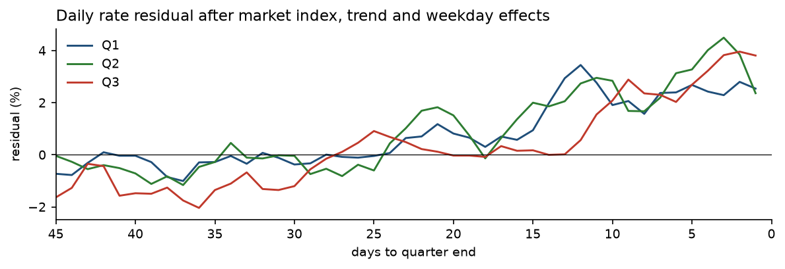
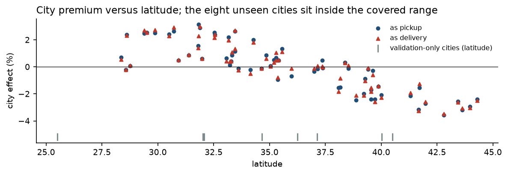
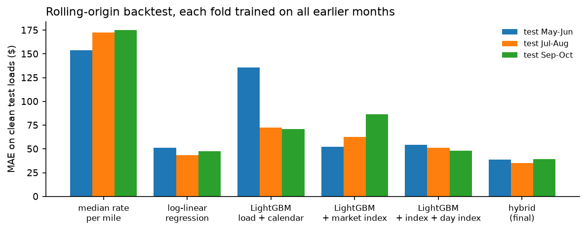
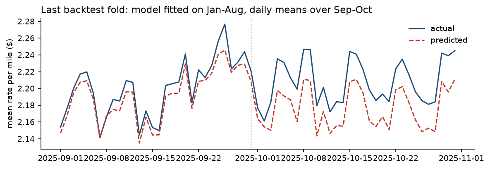

# Summary

The task is to predict the posted rate of 12,000 truckload shipments dated
November and December 2025, given 48,000 labelled loads dated January to
October 2025. Every load to predict is dated after the last labelled load, so I
treated this as a two-month-ahead forecast and validated it as one: model
selection used rolling-origin backtests, each fold training on all earlier
months and testing on the next two, never a random split.

The final model is a hybrid. A small linear component owns the time dimension
(log market index and its square, a linear trend, weekday and quarter-end
terms) and a LightGBM model fits the remaining load-level pricing from
distance, equipment, weight and coordinates. On the backtest fold that mirrors
the real task (fit on January to August, test on September and October) it
reaches a mean absolute error of \$39 and a mean absolute percentage error of
1.7% on loads with clean labels. Averaged over the three folds the MAE is
\$38, against \$51 for the best plain LightGBM configuration, \$47 for a
log-linear regression and \$167 for a rate-per-mile baseline.

Four data problems shaped the work: sign-flipped and missing weights, missing
market index values, 1.4% of labels multiplied or divided by a factor between
two and six, and a `quote_signal` column that is a near copy of the target in
some months, its mirror image in others, and pure noise in the prediction
window. Eight of the 72 validation cities never appear in training, which is
why the model prices geography through coordinates rather than city names.

# Data

## What the files contain

| | Training (`train_test.csv`) | To predict (`validation.csv`) |
|------|----------|----------|
| Loads | 48,000 | 12,000 |
| Dates | 2025-01-01 to 2025-10-31, 304 days | 2025-11-01 to 2025-12-31, 61 days |
| Loads per day | about 158 | about 197 |
| Cities | 64 | 72, eight of them unseen in training |
| Lanes (pickup, delivery) | 4,014 | 4,214, of which 736 unseen |
| Equipment | Dry Van 57%, Reefer 25%, Flatbed 18% | same mix |
| Distance | 70 to 3,440 miles, median 953 | same range |

Each load carries pickup and delivery city with coordinates, road distance,
equipment type, weight, date, `market_index` and `quote_signal`. The
coordinates are consistent (each city has exactly one pair) and the distance
is about 1.18 times the great-circle distance with a floor at 70 miles, so
neither needed cleaning. The December chart template carries only city names,
distance, equipment, weight and date.

## Quality issues and how I handled them

| Issue | Extent | Treatment |
|-----|------|---------------|
| Negative weights | 292 training loads, 145 validation loads | Sign flip: the magnitudes follow the same distribution as positive weights and the rates match heavy loads. Absolute value taken. |
| Missing weights | 300 and 165 loads | Left as missing; LightGBM handles it. The affected loads are otherwise unremarkable. |
| Missing `market_index` | 374 and 249 loads | Replaced by the daily mean of the index, see below. |
| Corrupted labels | 677 training loads (1.4%) | Rate multiplied by 2.2 to 5.3 (340 loads) or divided by 2.2 to 5.9 (337 loads), spread evenly over months and equipment. Excluded from training, reported separately in evaluation. |
| `quote_signal` | whole column | Dropped. Its relationship with the target changes sign by month and vanishes in the prediction window (section 2.4). |
| Unseen cities | 1,447 validation loads (12%) touch one | Geography enters the model only through coordinates; a held-out-city check quantifies the cost (section 4.4). |

The corrupted labels are easy to isolate. Figure 1 shows the posted rate
relative to a deliberately simple log-linear reference fit (distance,
equipment, weight, market index, trend). Clean loads sit within about
±25% of the reference; the corrupted ones sit at 0.17 to 0.45 or 2.2 to
5.3 times it, with nothing in between, so any cut-off in the gaps gives the
same set. The hidden validation labels presumably carry the same corruption.
Nothing can be done about that at prediction time, so the sensible target is
the clean rate, and I report errors both with and without the corrupted rows.

{width=100%}

## Structure worth modelling

**Load-level pricing.** Rates are close to a rate per mile times distance, with
a volume discount: log rate rises with log distance with a slope of 0.87, so
the rate per mile falls from about \$2.97 under 100 miles to \$1.89 above
2,500 miles. Reefer loads pay 13% more per mile than dry vans and flatbeds 8%
more. Heavier loads pay more, about 7% from the lightest to the heaviest
bucket, identically for all equipment types. Cities carry stable premiums of
up to ±3.5% (the same in the first and second half of the year,
correlation 0.98), and those premiums track latitude: southern origins and
destinations pay more (Figure 5). That is what makes coordinates a safe way to
price the eight cities the training data has never seen.

**Time.** Figure 2 shows the daily mean rate per mile and the daily mean
market index. Three things stand out. The market index is a market-wide daily
series with a strong weekly cycle (Monday 1.00 to Thursday 1.18 on average)
on a slowly shifting level; the per-load scatter around the daily mean has a
standard deviation of 0.025 and no correlation with the load's rate (0.03),
so the daily mean is the useful quantity and it fills the missing values for
free. Rates follow the index (daily correlation 0.65) but also drift upward
through the year and show a premium in the last two to three weeks of every quarter (Figure 3), peaking at about 5% in the final three days. The
quarter-end effect matters for December. Holidays showed no effect beyond the
weekday pattern, so I did not add holiday features.

{width=100%}

{width=100%}

## The `quote_signal` column

`quote_signal` looks like a rate-per-mile quote (mean 2.06, close to the
observed 2.22) and correlates with the target at 0.05 overall, which would
normally make it forgettable. Split by month it is anything but (Figure 4, left). In January, February, March, June and September its correlation with
the rate per mile is 0.99: the two agree to within a standard deviation of
0.025, so it is essentially the label. In April, May, July and October the
correlation is −0.99: the column equals 4.15 minus the rate per mile, a
mirror image. In August it is uncorrelated noise. The regime flips at month
boundaries with no pattern I could find.

Which regime the prediction window is in decides whether the column is useful
at all, and the validation file answers that without needing labels. In every
informative month the column separates by equipment, because reefer and
flatbed loads price differently. In August, November and December the mean
`quote_signal` is 2.05 for all three equipment types and its spread (0.22) is
the smallest of any month (Figure 4, right). The prediction window is a noise
regime. A model that had learned to use the column would either apply
October's mirrored relationship to noise or, at best, ignore it; it cannot
help. I dropped it. Section 3.4 shows what the split choice would have said
about this.

{width=100%}

{width=100%}

# Validation design

## Why a time-based split

The prediction window starts the day after the training window ends and runs
for two months. A random split would let the model see loads from the same
week on both sides, which measures interpolation, not the forecast the task
asks for. Three things in this data only show up under a time-based split: a
tree's inability to extrapolate the trend, the confounding between market
index and season (both rise from January to May), and the `quote_signal`
regime changes. All three would have been invisible under random
cross-validation and all three mattered for the final model.

## Folds

I used three rolling-origin folds, each training on every load before the test
window and testing on the next two months, with corrupted labels removed from
the training side:

| Fold | Fit on | Test on | Test loads |
|---|---|---|---|
| 1 | January to April | May and June | 9,689 |
| 2 | January to June | July and August | 9,719 |
| 3 | January to August | September and October | 9,523 |

Fold 3 has the same shape as the real task. Folds 1 and 2 guard against
tuning to one particular pair of months; the market index steps down sharply
in mid July, for instance, which only fold 2 tests. Model choices were made
on the mean over folds, and the final model was refitted on all clean
training loads with the settings fixed by the backtests.

## Metrics

Spotter's metric is not disclosed, so I report MAE, RMSE, MAPE and R$^2$ in
dollars of posted rate. All are computed on test loads with clean labels (the
quantity the model is meant to predict) and MAE and MAPE additionally on all
test loads including the corrupted ones, since the hidden validation labels
presumably include them. The corrupted rows dominate RMSE on the full set
and set a floor no model can beat, which is why the clean-label numbers are
the ones used for selection.

## What a random split would have said

The check in `backtest.quote_signal_check` fits the same LightGBM model with
and without `quote_signal`, once under random 5-fold cross-validation and once
on the time-based folds, reporting the MAE per test month:

| Evaluation | MAE without `quote_signal` | MAE with `quote_signal` | Change |
|---------|------|------|----|
| random 5-fold, all months | 38.0 | 35.0 | -8% |
| time-based, test May | 43.2 | 37.6 | -13% |
| time-based, test Jun | 74.7 | 84.5 | +13% |
| time-based, test Jul | 45.9 | 40.1 | -13% |
| time-based, test Aug | 61.9 | 68.7 | +11% |
| time-based, test Sep | 43.1 | 40.3 | -6% |
| time-based, test Oct | 60.1 | 55.8 | -7% |

Under a random split the column looks useful (8% lower error). Under the time-based
folds it helps in some months and hurts in others by up to 13%, depending on
whether the test month happens to share the regime of the months before it.
Since the prediction window is a noise regime, the right expectation for
November and December is no gain at all, and the risk is on the downside.

# Model

## Candidates

All models predict log posted rate and are evaluated in dollars. The features
common to all learned models are log distance, equipment, weight, the four
coordinates, day of week, days to quarter end and day of quarter. Month and
day of year are deliberately excluded: November and December never occur in
training, and a tree would map them onto whichever leaf happens to be
adjacent. Day of week and position within the quarter take the same values
in the fourth quarter as in the first three.

- *Median rate per mile by equipment, times distance.* The naive baseline.
- *Log-linear regression.* The time design below plus linear terms in log
  distance (and its square), equipment, weight and coordinates.
- *LightGBM, load and calendar features.* No market or trend information.
- *LightGBM plus daily market index.*
- *LightGBM plus daily market index plus a day index.* The day index lets the
  tree hold the level of the last training weeks for later dates.
- *Hybrid.* Described next.

## The hybrid

A gradient-boosted tree has two problems with the time dimension here. It
cannot extrapolate: for any date past the training window it returns the
level of the last leaf. And within the training window the market index and
the season are confounded, so it may attribute the spring rise to the index
and then, seeing similar index values in September, predict February-like
rates. In the backtests the plain tree with the market index was worse than
the tree without it on the last fold for exactly this reason.

The hybrid separates the two roles. A linear model owns the time component:

$$\log(\text{rate}) = a + \beta_1 \log m + \beta_2 (\log m)^2 + \gamma\, t + \delta_{\text{weekday}} + \theta_{\text{quarter-end bucket}} + f(\text{load})$$

where $m$ is the daily mean market index, $t$ is time in years and the
quarter-end buckets are 0 to 3, 4 to 7, 8 to 14, 15 to 21 and 22 to 30 days before quarter
end. $f$ is a LightGBM model on log distance, equipment, weight, coordinates,
weekday and days to quarter end. The two parts are fitted by backfitting: the
linear part on log rate minus the current tree prediction, then the tree on
log rate minus the linear part, repeated twice. A third pass did not improve
the backtests and a single pass was clearly worse. The trend term exists only
in the linear part, so the level extrapolates as a straight line in log space
rather than freezing, and the market index enters with a fitted elasticity
instead of a learned lookup.

The fitted time component on all training data is readable:

| Term | Coefficient (log scale) | Meaning |
|------|-----|-----------|
| log market index | 0.141 | elasticity of about 0.14 at index 1.0 |
| (log market index)$^2$ | 0.115 | rates react more strongly when the index is high (elasticity 0.20 at 1.3, 0.10 at 0.85) |
| trend | 0.064 per year | about 0.5% per month |
| quarter end, last 3 days | 0.052 | +5.3% |
| quarter end, 4 to 7 days | 0.033 | +3.3% |
| quarter end, 8 to 14 days | 0.016 | +1.6% |
| quarter end, 15 to 21 days | 0.021 | +2.1% |
| quarter end, 22 to 30 days | 0.003 | negligible |
| weekday terms | within ±0.01 | the weekly cycle is carried by the index |

Adding the squared index term improved every fold. Lagged versions of the
index (7, 30 and 60 day means), a start-of-quarter dip, daily rather than
bucketed quarter-end dummies and equipment-specific time terms were all
tested and rejected: none improved the mean over folds and most made at least
one fold worse. LightGBM settings (31 leaves, minimum 40 loads per leaf,
learning rate 0.03, 1,500 rounds, 80% feature and row subsampling) were
chosen from a small grid; the alternatives moved the mean MAE by about a
dollar either way.

## Results

Mean absolute error in dollars on test loads with clean labels, per fold and averaged:

| Model | Fold 1 (May-Jun) | Fold 2 (Jul-Aug) | Fold 3 (Sep-Oct) | Mean |
|-------------|----|----|----|----|
| Median rate per mile by equipment | 153.7 | 172.4 | 175.1 | **167.1** |
| Log-linear regression | 51.1 | 43.6 | 47.7 | **47.5** |
| LightGBM, load and calendar features | 135.7 | 72.4 | 70.6 | **92.9** |
| LightGBM, plus market index | 52.4 | 62.8 | 86.3 | **67.2** |
| LightGBM, plus market index and day index | 54.5 | 51.1 | 48.0 | **51.2** |
| Hybrid (final) | 38.6 | 35.1 | 39.1 | **37.6** |

Other metrics, averaged over the three folds. The last two columns include the corrupted test labels:

| Model | RMSE | MAPE | R$^2$ | MAE, all rows | MAPE, all rows |
|-------------|----|----|----|----|----|
| Median rate per mile by equipment | 234.0 | 8.33% | 0.9702 | 219.3 | 10.53% |
| Log-linear regression | 68.2 | 2.05% | 0.9975 | 101.4 | 4.40% |
| LightGBM, load and calendar features | 122.1 | 3.84% | 0.9917 | 146.2 | 6.15% |
| LightGBM, plus market index | 93.6 | 2.83% | 0.9952 | 120.8 | 5.12% |
| LightGBM, plus market index and day index | 73.9 | 2.19% | 0.9971 | 105.1 | 4.54% |
| Hybrid (final) | 54.8 | 1.63% | 0.9984 | 91.6 | 3.99% |

{width=100%}

The ordering is the same on every fold. Two things are worth noting. The
log-linear regression beats every plain LightGBM configuration, which says the
hard part of this problem is the time structure, not the load-level
non-linearity. And the pure tree with the market index but no day index is
the worst learned model on the last fold, the confounding failure described
above.

{width=100%}

Figure 7 shows the hybrid tracking the daily level through the fold-3 test
window, including the September quarter-end rise and the drop on October 1,
neither of which is in its training window at those dates. The residual bias
over the window is small but not zero: the model runs about 0.4% low in September and 1.4% low in October, so the extrapolated level errs slightly on the conservative side as the horizon grows.

## Unseen cities

Twelve percent of the validation loads touch one of eight cities absent from
training. To measure the cost, I refitted the hybrid on fold 3 with six
randomly chosen training cities (Greensboro, Milwaukee, Salt Lake City,
Houston, New York, Amarillo) removed and compared test loads that touch them
against the rest:

| Test loads | n | MAE | RMSE | MAPE | R$^2$ |
|----------|---|---|---|---|---|
| loads touching held-out cities | 1,672 | 46.0 | 64.8 | 2.14% | 0.9974 |
| other loads | 7,707 | 40.1 | 57.8 | 1.77% | 0.9983 |

Loads involving an unseen city cost about 0.4 points of MAPE, which is the
price of pricing geography from coordinates alone rather than a city
identifier. The eight real unseen cities sit inside the latitude and
longitude range of the training cities (Figure 5), so this estimate should
transfer.

# December series

The chart template fixes the lane (Lexington to Fort Wayne, 360 miles, dry
van, 32,000 lb) and varies only the date. The template carries no coordinates
or market index, so the coordinates come from the city lookup and the market
index for each December day is the mean `market_index` of the roughly 200
validation loads dated that day, exactly as it is for every other prediction.
The prediction therefore shows the time effects the model learned: the
weekly cycle carried by the index (Thursday peaks), the slow drift, and the
quarter-end premium in the last week, ending at \$869 on December 31 against
\$828 on December 1.

{width=100%}

The level is consistent with the lane's history: the same lane and equipment
priced between \$778 and \$865 in September and October, and the model's
in-sample predictions for those loads are within 1 to 3%.

# Reproducing the results

The repository contains the data, the code, and the outputs. From a clean
checkout:

```
python3 -m venv .venv && source .venv/bin/activate
pip install -r requirements.txt
python -m pytest tests -q
python -m freight.train --backtest
python -m freight.predict
python score.py --predictions outputs/validation_predictions.csv \
                --december-predictions outputs/december_chart_inputs.csv \
                --output-dir outputs/scorer_results
```

Training with backtests takes about a minute on a laptop; the final fit alone
takes a few seconds. Results are deterministic. The unit tests cover the
cleaning rules, the calendar features on December dates, the label screening
on planted corruption, and that the hybrid recovers a known elasticity, trend
and quarter-end effect from synthetic data.

# Limitations

The trend is extrapolated as a straight line in log space for two months
beyond the data. The three folds support that choice (a model without the
trend was much worse on every fold, and lagged market indices did not replace
it), but a year-end break in the drift would not be visible from ten months
of history. The quarter-end premium is assumed to apply to December as it did
to March, June and September; the December estimate is the average of those
three. Finally, if Spotter's metric is RMSE on all loads including the
corrupted ones, predictions could be nudged up by about 1% to hedge the
asymmetric corruption; I chose not to, since the clean rate is the quantity
that is actually useful.
